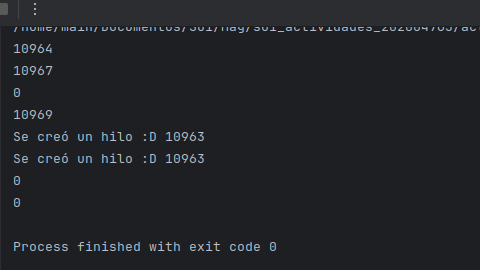

# <h1 style="text-align: center;">Actividad 5</h1>

## a) ¿Cuántos procesos únicos son creados?

Se crearon 4 procesos unicos, en esta ejecucion fueron los proceso con PID 10964, 10967, 10969, 0.
El proceso inicial tiene un PID de 10964.
Después de la primera llamada a fork(), se crea un proceso hijo con un PID de 10967.
En el proceso hijo creado por la primera llamada a fork(), se hace otra llamada a fork(), lo que crea un proceso nieto con un PID de 10969.
Luego, dentro del proceso hijo original (PID 10967), se hace una llamada más a fork(), lo que resulta en la creación de un cuarto proceso con un PID de 0. Esto sucede porque el valor de retorno de fork() en el proceso hijo es 0.
En total, hay 4 procesos únicos.

## b) b)¿Cuántos hilos únicos son creados?

Se crea un hilo único en el proceso hijo original (PID 10967), ya que la llamada a pthread_create() está dentro del bloque condicional if (pid == 0). Este hilo imprime su PID dos veces, ya que un hilo puede tener el mismo PID que el proceso principal al que pertenece.
En total, hay 1 hilo único.
